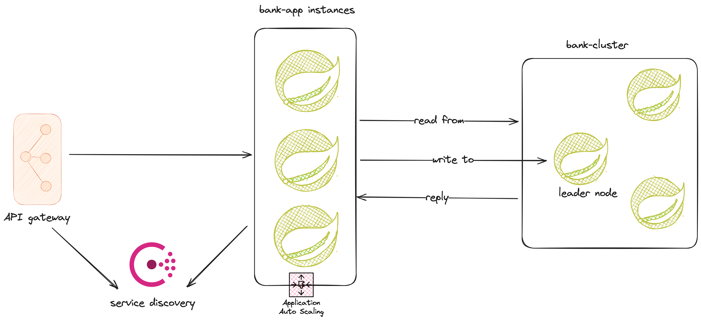
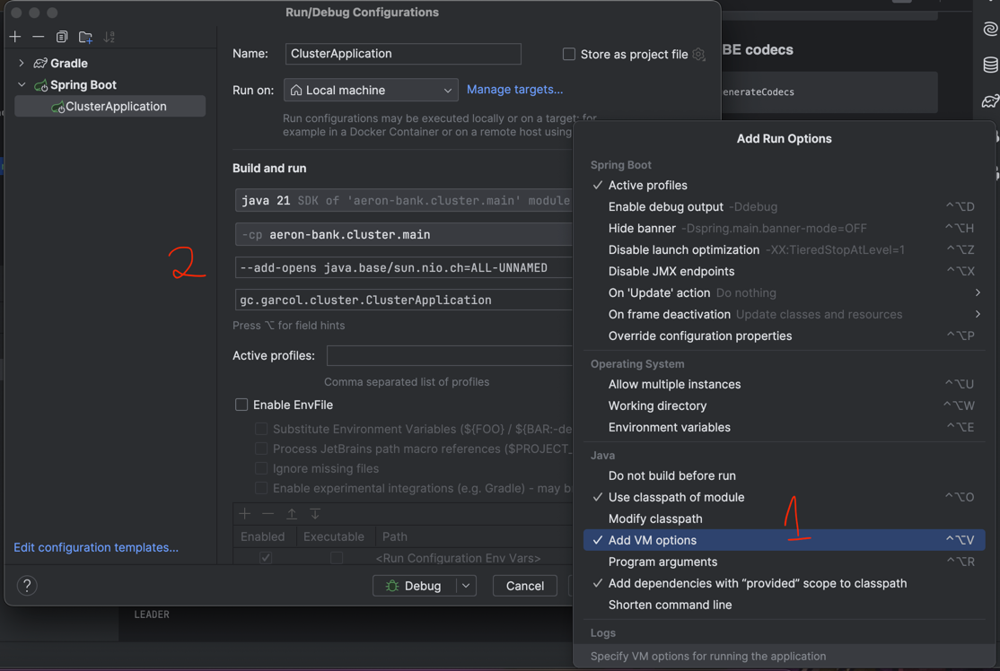

# BANK ACCOUNT

## Tech stacks
- `Raft consensus algorithm`
- `Aeron Cluster`
- `Java 21`

## Pre-requisites
- `Java 21`

## High-level design

### Architect overview


## Project structure

- `bank-cluster` - Domain logic
- `bank-app` - Client application that interacts with the cluster
- `bank-libs` - Common modules

## Run project
```shell
make build-jar

make build-image

make run-containers
```

### Generate SBE codecs
```shell
./gradlew generateCodecs
```

## Run local
```shell
./gradlew runSingleNodeCluster --args='--aeron.cluster.port=9000 --aeron.cluster.node=0 --aeron.cluster.baseDir=node0'
```

## ISSUES

### Problem
Caused by: java.lang.reflect.InaccessibleObjectException: Unable to make field private final java.util.Set sun.nio.ch.SelectorImpl.selectedKeys accessible: module java.base does not "opens sun.nio.ch" to unnamed module @XXXXXX

### Solution
Add ``--add-opens java.base/sun.nio.ch=ALL-UNNAMED`` to the JVM arguments.


